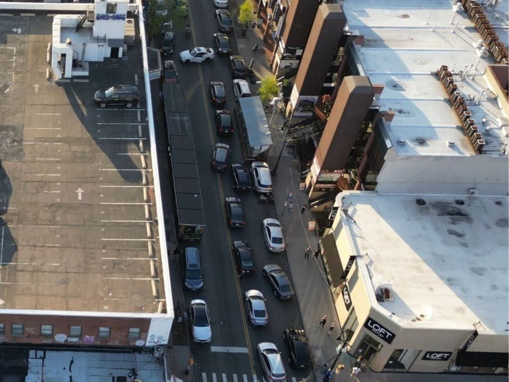
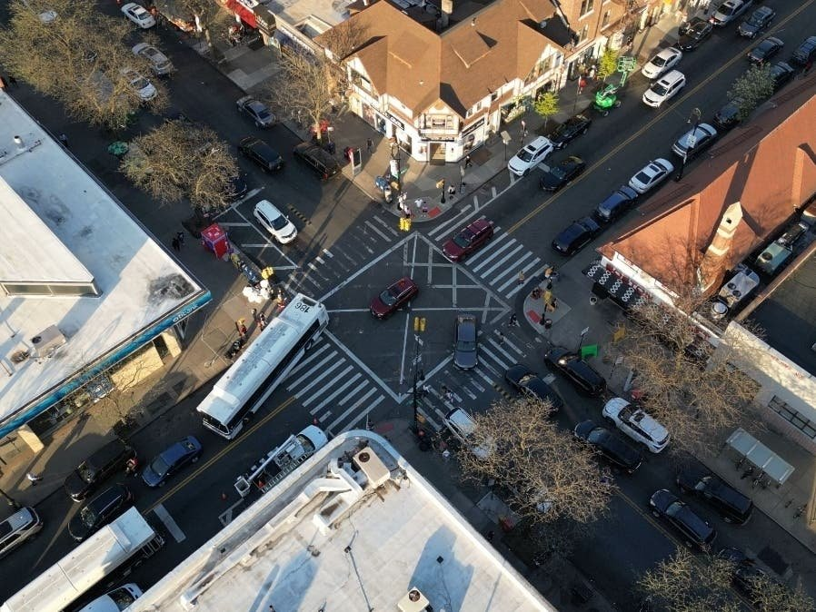

Moving to Forest Hills just before the pandemic was a decision my wife and I made with great enthusiasm. We were drawn to the beautiful neighborhood, Forest Park, and its proximity to the most diverse food spots NYC has to offer. We love venturing out to Jackson Heights on foot or even farther areas by bikes (when the route feels safe to do so). However, it’s sad to admit that Austin Street is an area that we generally avoid due to the dangers it poses to pedestrians: narrow and crowded sidewalks, vehicles ignoring pedestrian’s right of way, and the pollution from idling, honking cars.

It was disappointing to learn that the Chamber of Commerce leadership, Leslie Brown, vehemently opposes [CB6’s request](https://patch.com/new-york/foresthills/forest-hills-community-board-backs-ask-car-free-austin-street)to the DOT to conduct a study on Austin Street prioritizing pedestrian safety. Instead, it seems they will [pay for their own study](https://youtu.be/kApxhM1UZHc?t=370), and in my opinion, likely to be tailored to what they’d like to hear. As a resident, it is extremely upsetting that safety concerns are being prioritized secondarily or not at all. This sentiment was reiterated during the CB6 meeting held in early April, where it seemed that many individuals neither fully comprehended the resolution nor understood the commonality of such requests. One speaker, who boasted about being in Forest Hills for 50 years, seemed particularly condescending— calling the plea for a safer Austin Street a [“pipe dream” and “some utopian nonsense a guy came up with out of the blue”](https://www.youtube.com/watch?v=kApxhM1UZHc&t=2383s). That’s odd because the issues can be traced back to [1979](https://www.nytimes.com/1979/12/30/archives/austin-street-beset-by-the-troubles-of-success-austin-street-beset.html) and intensified today with an average of [](https://crashmapper.org/#/?cfat=true&cinj=true&endDate=2023-03&geo=custom&identifier=&lat=40.71966844792822&lng=-73.84412705898285&lngLats=%5B%5B-73.85126709938048%2C40.72267296820733%5D%2C%5B-73.85059118270874%2C40.722437165024736%5D%2C%5B-73.84009838104248%2C40.71840398815792%5D%2C%5B-73.8402807712555%2C40.718119379753446%5D%2C%5B-73.85162115097046%2C40.72251847656138%5D%2C%5B-73.85151386260986%2C40.722713623843994%5D%2C%5B-73.8512885570526%2C40.722713623843994%5D%2C%5B-73.85120272636414%2C40.72264044368007%5D%2C%5B-73.85126709938048%2C40.72267296820733%5D%5D&mfat=true&minj=true&noInjFat=false&pfat=true&pinj=true&startDate=2013-03&vbicycle=true&vbusvan=true&vcar=true&vmotorcycle=true&vother=true&vscooter=true&vsuv=true&vtruck=true&zoom=17). The speaker’s remarks were nauseating and reminded me of why we can’t have nice things. To set the record straight, [again](https://twitter.com/QueensCB6/status/1638196776585838592?cxt=HHwWgIC2yb3ShbwtAAAA), CB6 chairs addressed some misinformation and concluded the night with an appropriate proverb: “A society grows great when old men plant trees in whose shade they shall never sit”.

Austin Street needs to be fixed rather than ignored. It is time for those in positions of authority to prioritize our safety and urge DOT to follow up on the request and conduct a comprehensive study.
