We had our first field event on Saturday! Thank you all who came out and helped us map Austin Street pedestrian access.

Before we get into the results, some terminology is important to understand.

## Anatomy of a sidewalk

Three zones comprise a sidewalk: the walk lane, the clear path, and the furnishing zone.

#### Walk Lane

The portion of the sidewalk that accommodates pedestrian movement. This includes a clear path and can also include other amenities. An example of this would be a sign advertising a business. Such a sign can only be close to the building and cannot cross into the Clear Path.

#### Clear Path

The portion of the walk lane that is free from amenities for uninterrupted pedestrian flow.

#### Furnishing Zone

The section of the sidewalk between the curb and walk lane that does not accommodate pedestrian movement. Amenities, such as lighting, benches, tree beds, utility poles, or bicycle parking, can be placed in this section.

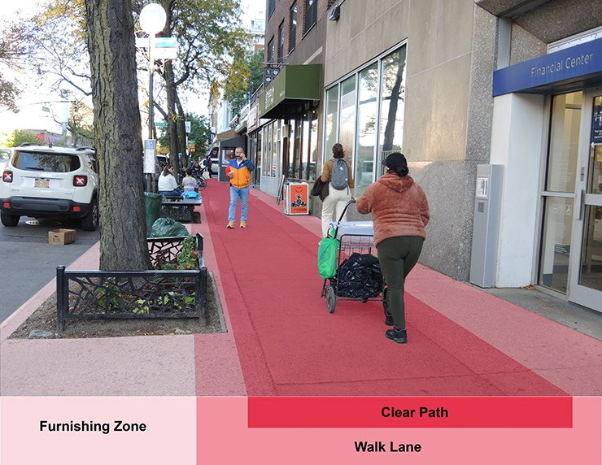

The “width of the sidewalk” refers to all three zones combined. The City of New York has compiled a report that shows how wide every single sidewalk in NYC should be, according to usage. You can find the plan here: [https://www.nyc.gov/html/dot/html/pedestrians/pedestrian-mobility.shtml.](https://www.nyc.gov/html/dot/html/pedestrians/pedestrian-mobility.shtml)

Using the map on that site, we can see that Austin Street is considered a “**Neighborhood Corridor**.”

According to the city, **Austin Street sidewalks should be at least 15 feet wide**, with a **clear path at least 8 feet wide**.

So, how did Austin Street fair? Does it meet the standards set up by the city? Let’s find out!

## The Field Study Results

We all know this; you don’t need a study to see it: Austin Street sidewalks are too narrow. **Though the sidewalks can get as wide as 10'**, which is still **5 feet too narrow** according to the city's Pedestrian Mobility Plan, with tree pits, cellar doors, and other obstructions, **the clear path can narrow to around 3-5 feet**! In some areas, you get a double whammy, with a cellar door and a tree pit together narrowing the clear path to a mere foot.

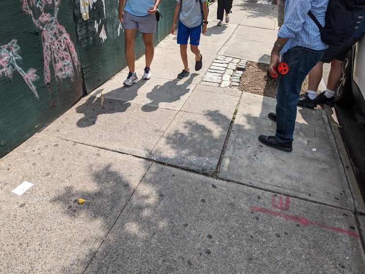
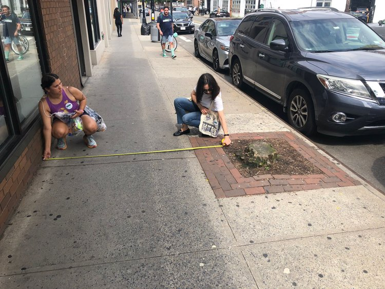

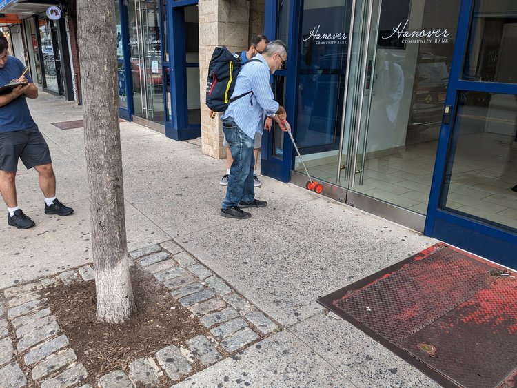

In some areas, a combination of a cellar door and a tree pit can make the clear path as narrow as a foot!

Because the overall sidewalks are so narrow, any additional temporary obstruction, such as scaffolding, greatly hurts pedestrian mobility.

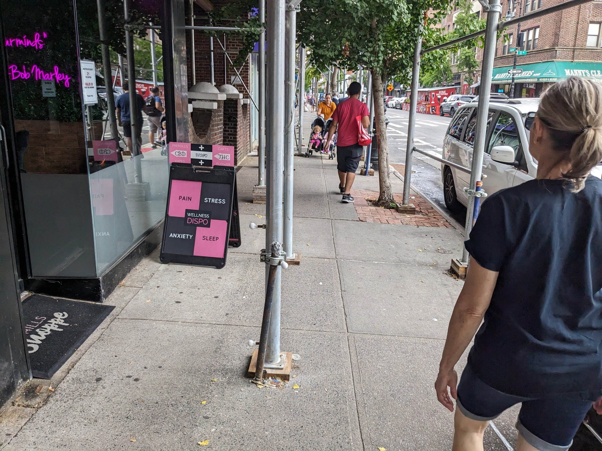

New York City recently announced a new initiative to combat rats. The initiative requires businesses that sell food to put their garbage inside lidded containers. Since not all businesses have the space to store these containers, businesses can store them on the sidewalk, in the “Walk Lane” (outside the Clear Path). This initiative is good and can potentially fix the rat problem in NYC, but it introduces a new issue for the already narrow sidewalks of Austin Street.

The containers are meant to be stored in the Walk Lane and moved to the Furnishing Zone when it is time for pick up. But as we’ve already seen, the Furnishing Zone and Walk Lane of Austin Street sidewalks double as walking space, so they narrow the space further. To make things worse, the garbage containers can be left in the Clear Path, as shown below. We also observed some being put in tree pits, which is bad for the trees.
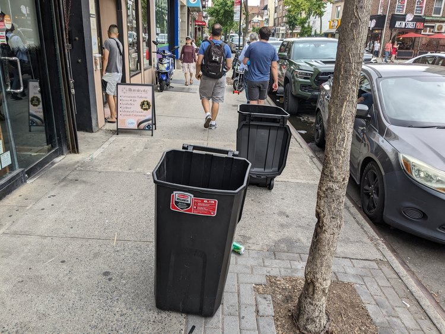

_Garbage containers on the sidewalk, inside the clear path._

_Garbage containers inside the furnishing zone, in a tree pit._

## The Overall Cleanliness Problem

Though we were focusing on pedestrian mobility, we couldn’t help but notice the cleanliness issue Austin Street seems to suffer from. Due to bad drainage, there were several areas where water had pooled on Austin Street. For example, that Saturday morning, the intersection of 72nd Rd and Austin Street smelled awful. We noticed some water pooling on the south side and determined that’s where the smell was coming from. We confirmed later that the smell lasted all day.

We hope the city can also fix this drainage issue while redesigning the street to prioritize safety. We also hope the city can provide some of the on-curb garbage containers we have seen in other commercial districts.

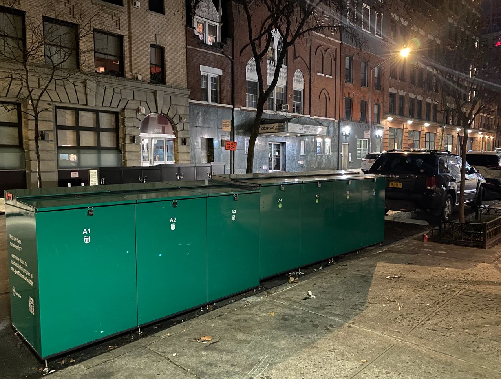
_Curb-side containers, part of the CleanCurbs program. Photo: Kevin Duggan_

## The Empty Tree Pits

We observed several empty tree pits on Austin Street. Some pits were covered with bricks, while others still had the tree stump sticking out, creating a tripping hazard. We do not know what happened to these trees, but we ask that the NYC Parks replace them.

Mysteriously missing tree. Only the stump left.

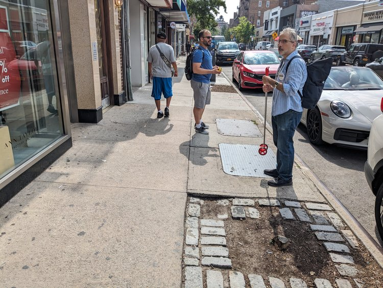

Trees are essential to a vibrant Austin Street and can help with the Urban Heat Island effect. [See this video](https://www.instagram.com/p/CvQfsahv5H_pvMU1RJRQlCQ0rEpDTyUvnGY5Y80/) showing just how much of an effect trees can have.

## Unmet Bike Parking Demand

Another observation we made while doing our study was the large amount of unmet bike parking on Austin Street. As we know, Austin Street has a good amount of bike parking on 71st Ave, which is always full. There are a couple of loops on other side streets, but Austin Street itself lacks bike parking, leading to many people attaching their bikes to trees and signs. Attaching your bike to a traffic sign is legal, but it is not legal to do so to a tree. It can hurt the tree, so please refrain from doing so.

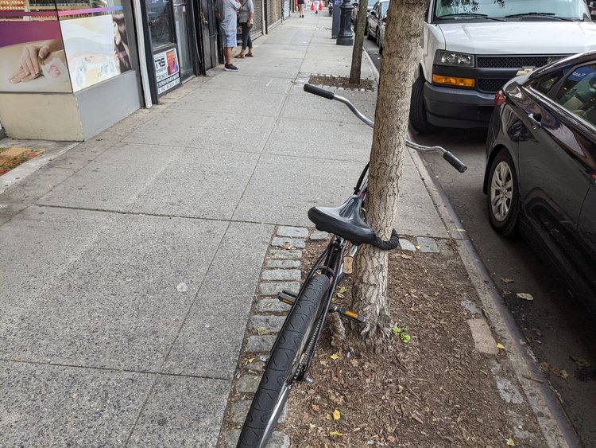
A bike attached to a tree. This is illegal and can hurt the tree.
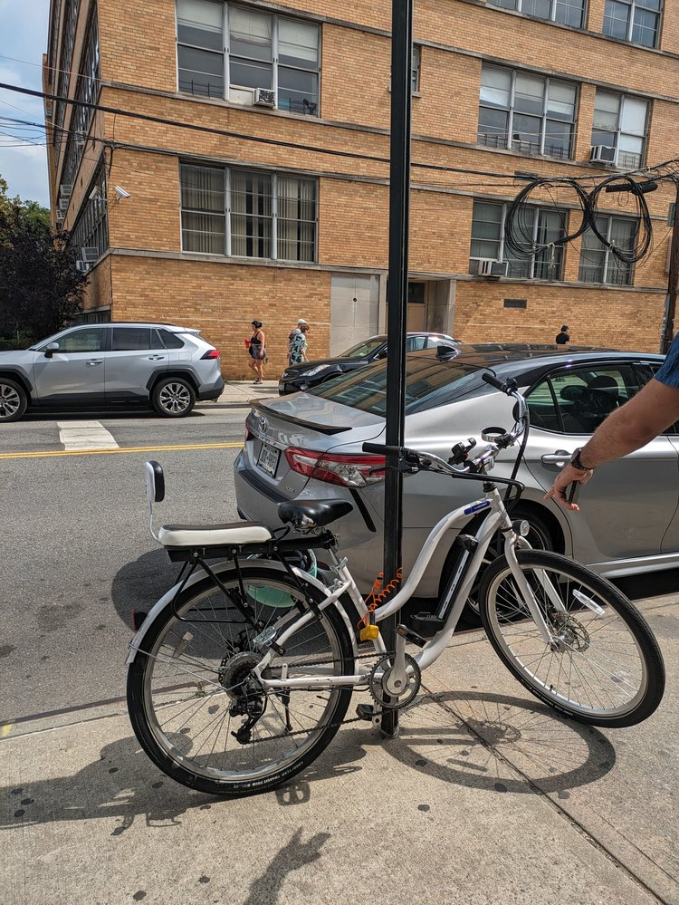
_A bike attached to a traffic sign._

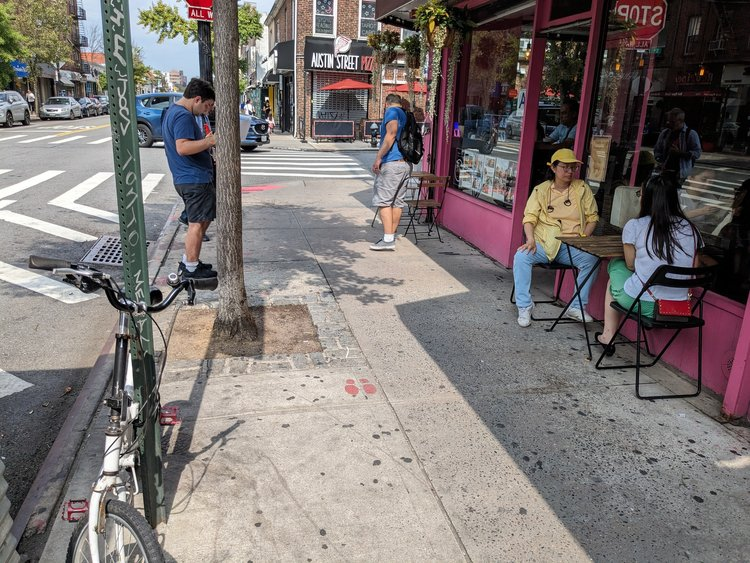
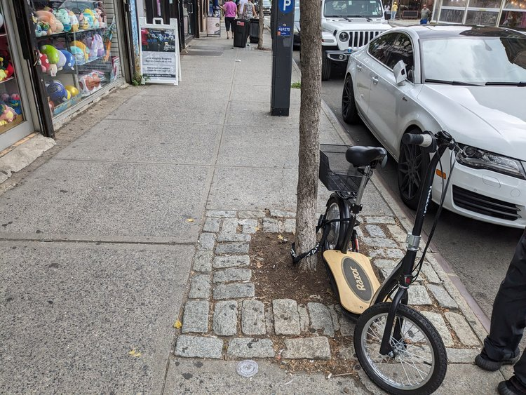

## Conclusion

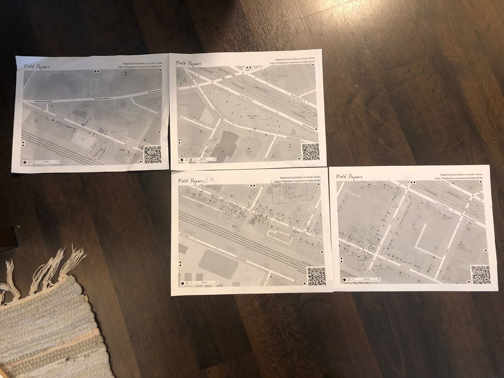

_Field papers_

In conclusion, as we all know, Austin Street's sidewalks are too narrow and need to be expanded. This is why we made sure that our petition to DOT to fix the pedestrian hazards on Austin Street explicitly calls for wider sidewalks. Sidewalks are the backbone of any street; without clear paths for people to walk, talk, and linger can discourage foot traffic. Austin Street is our area’s downtown; the last thing we want is to discourage foot traffic.

A new law passed by the city will eliminate all the restaurant sheds on Austin Street while making year-round sidewalk cafes easier to apply for. However, due to the lack of sidewalk space, businesses on Austin St. will be hard-pressed to implement popular sidewalk cafes, putting our downtown at a disadvantage.

For these reasons, we call on DOT to **expand the sidewalks on Austin Street ASAP**.

We also call on DOT to work with Sanitation and Parks to implement permanent fixes to the garbage management issues on Austin Street and replace and relocate tree pits to allow for more walking space. We want Austin Street to be a nice, clean, tree-lined street, but we don’t want the trees and garbage containers preventing wheelchairs and strollers from moving freely.

Lastly, we call on DOT to install more bicycle parking up and down the strip to discourage tree parking and meet the unmet parking demand. The current sidewalks are too narrow to add bicycle parking, but more space should be available once they are expanded.
