# The Problem

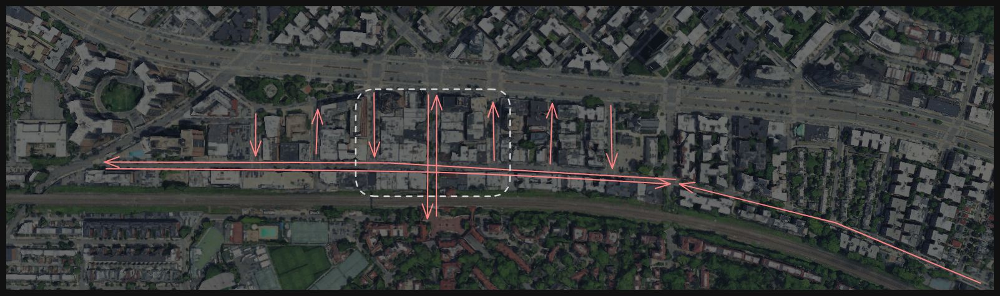

The traffic on Austin Street is legendary in the neighborhood, as well as old. Back in 1979, the [New York Times was already writing about the congestion issues on it.](https://www.nytimes.com/1979/12/30/archives/austin-street-beset-by-the-troubles-of-success-austin-street-beset.html) Since then, congestion has only gotten worse, while the street's design has remained essentially unchanged.

  Several issues with Austin St lead to all traffic on it, but some of the main problems are:

1. Thru-traffic. There are two types of through traffic on the Austin Street Corridor:
	1. East-West: It is possible for a driver to drive all the way from Union Turnpike to Yellowstone Blvd on Austin Street and hit only four lights, whereas on Queens Blvd, they would hit ten.
	2. North-South: Since 71st Ave is one of the few north-south roads, there’s a lot of traffic cutting through the area.
2. Turning Conflicts on 71st Ave. Austin St is very narrow and doesn't have space for turning lanes. So turning vehicles at 71st leads to a lot of conflict with north-south traffic.
3. High pedestrian traffic leads to frequent street crossings, especially since the street is so narrow that crossing it feels quick and easy, increasing the chances of crashes and increased congestion as pedestrians block car traffic.
4. The Barnes Dance. NYC DOT installed a Barnes Dance (pedestrian scramble) in 2023 to increase pedestrian safety at the intersection. While this is safer for pedestrians, it adds another light phase to the intersection, which means more congestion as drivers now need to wait even longer. 

There are other issues plaguing Austin Street beyond traffic, including very narrow sidewalks, a lack of public seating, a lack of greenery, and flooding. This proposal aims to solve some of those issues as well.

## The Q23 bus change

The issues with the Q23 on Austin Street have plagued the neighborhood for many years: once the bus entered Austin Street, especially the blocks between 71st Ave and 70th Ave, its speed would drop to a crawl. After many years of complaints and a lack of action from NYC DOT, the MTA decided to move the bus off of Austin Street and redirect it down Yellowstone Blvd and Queens Blvd. 

This change has had a significant adverse effect on the community, such as:
1. Bus stops are now further away from the LIRR    
2. Bus stops are now further away from the Austin St Commercial District
3. Bus riders now need to cross Queens Blvd to access the 71st Ave elevator
4. The old 71st Ave bus stop has better infrastructure for the bus riders (eg, seats, a canopy, a countdown clock, and a wide sidewalk). These are all missing in the new stop on 108th, and the sidewalk is very narrow.
	1. Since the bus redesign removed half the stops, more people are now standing on the narrow sidewalk.

Below are some images showing the lines at the new 108th bus stop. Residents of the nearby building have complained about blocked sidewalks.

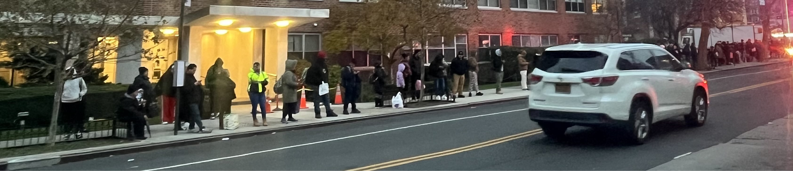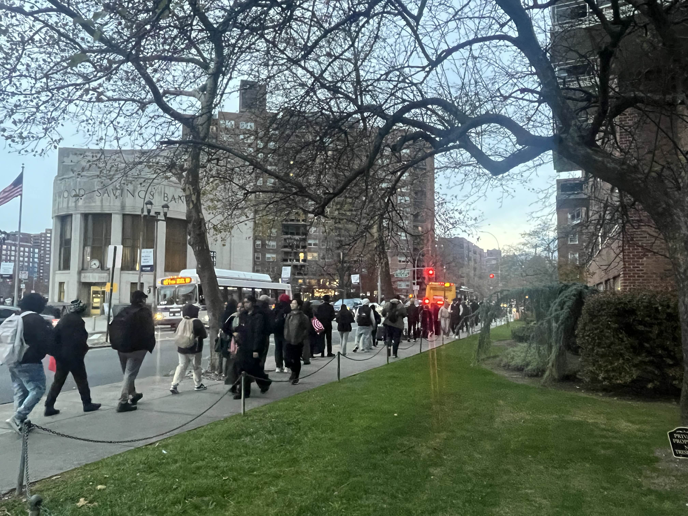

To make things worse, many community members have complained that the bus is still slow and unreliable, meaning that the trade offs listed above did not yield a better bus experience. 
# Crash Data

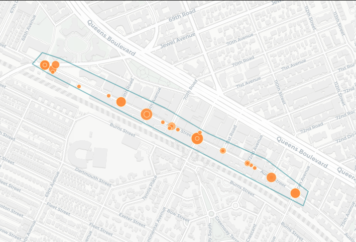

We are Neighbors for A Safer Austin Street so safety is our number one priority. According to [crashmapper.org](https://crashmapper.org/#/?cfat=true&cinj=true&endDate=2025-12&geo=custom&identifier=&lat=40.71942856833878&lng=-73.84240508079527&lngLats=%255B%255B-73.8402271270752%252C40.71795674583317%255D%252C%255B-73.840012550354%252C40.71842838310738%255D%252C%255B-73.84183645248413%252C40.71948548899755%255D%252C%255B-73.84436845779419%252C40.72034742445287%255D%252C%255B-73.84617090225218%252C40.72116056087766%255D%252C%255B-73.85069847106934%252C40.72278680392749%255D%252C%255B-73.85147094726562%252C40.722981950423396%255D%252C%255B-73.85190010070801%252C40.722607919136934%255D%252C%255B-73.85125637054443%252C40.72231519753357%255D%252C%255B-73.8402271270752%252C40.71795674583317%255D%255D&mfat=true&minj=true&noInjFat=false&pfat=true&pinj=true&startDate=2011-08&vbicycle=true&vbusvan=true&vcar=true&vmotorcycle=true&vother=true&vscooter=true&vsuv=true&vtruck=true&zoom=16), which obtains its data from the NYPD, there have been 171 crashes with 198 injuries on Austin Street between Yellowstone Blvd and Ascan Ave. from 2011 to December 2025.

This proposal aims to significantly decrease these injuries by reducing the amount of traffic on Austin Street, extend sidewalks and implement hardened daylighting. 
# Proposal: The Austin One-Way and Busway Proposal

At its core, the issue with Austin Street is two-fold: through traffic and turns at the busy 71st Ave intersection. This proposal addresses both issues and allows for the return of the Q23 bus to Austin Street.

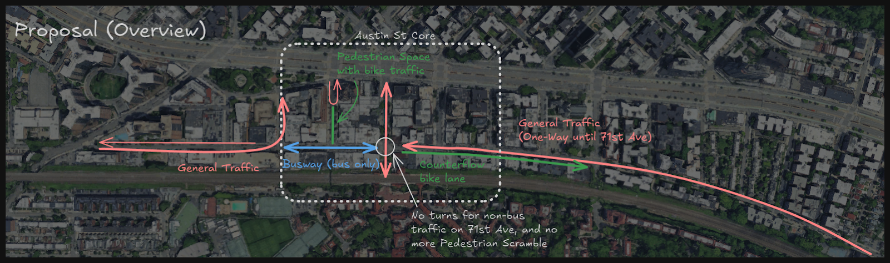

## East of 71st Ave

This segment continues the one-way pattern east of Ascan Ave on Austin Street. Parking would be moved closed to the center in order to create a one-lane, one-way street. Sidewalks can be expanded to fill up the remaining space. 

A counterflow bike lane is necessary to maintain bike access to the entire street and further encourage residents to bike, as well as discourage sidewalk riding in the newly expanded sidewalks.

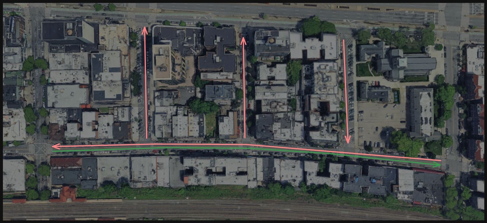

Zooming in on one block we can see how the parking can be moved and the sidewalk extended.

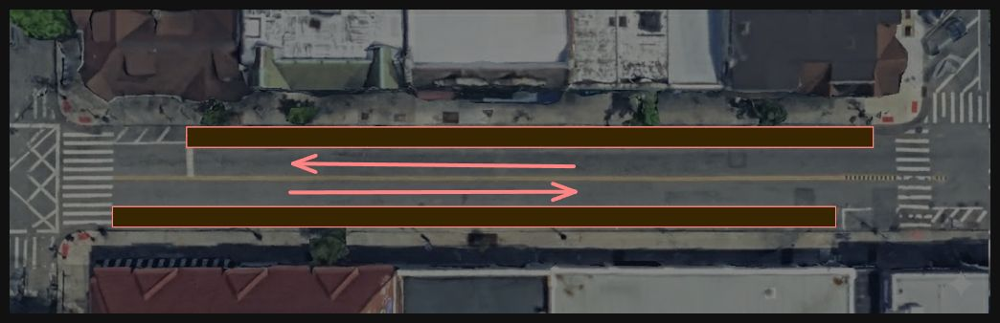
*Current configuration. The brown bars are currently curbside parking.*

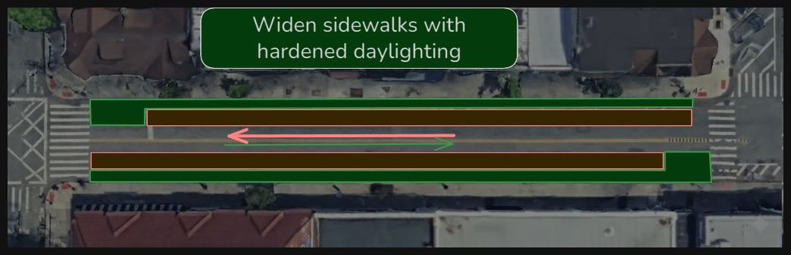
*Proposed configuration. The sidewalks are widen, hardened daylighting is added, and the parked cars are brought in to narrow the lane. A counterflow bike lane is added to allow bike traffic.*

## The 71st Ave Intersection

At the critical 71st Ave intersection, turns from 71st Ave onto Austin Street are no longer allowed for private vehicles, allowing north-south traffic to flow smoothly and uninterrupted by turning vehicles. Additionally, since turns are now rare, we can return the traffic light to a simpler two-phase light.

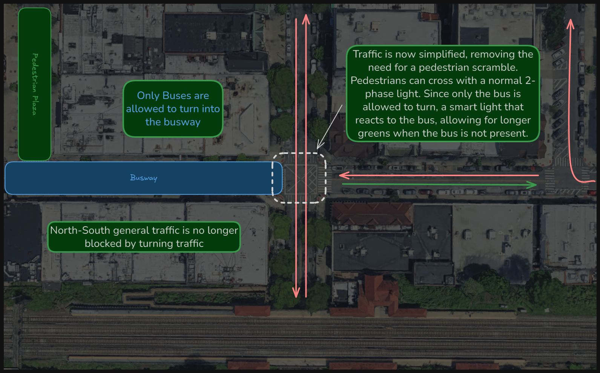

## West of 71st Ave (the busway)

On the western side of 71st Ave, private vehicles can now only drive so far as to 70th Ave before turning. Buses and deliveries can be allowed on the busway. Cameras can be used to enforce the busway, freeing up capacity at the 112th. Before the Q23 left Austin Street, these two blocks were a major bottleneck, slowing the bus significantly.

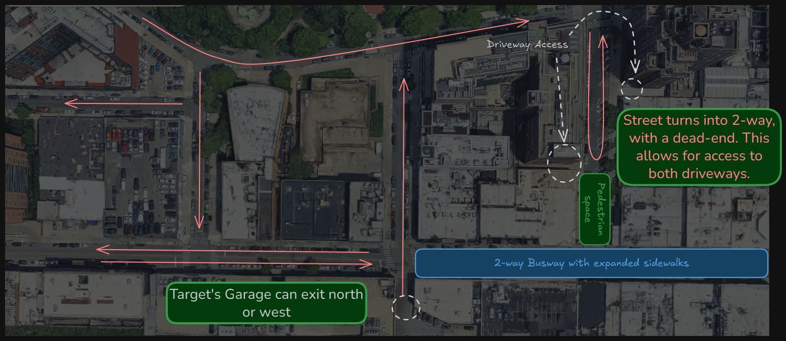

Since cars cannot enter the busway, 71st Rd (Restaurant Row) needs to be modified. A pedestrian plaza at the southern end of the street and a cul-de-sac allow vehicles to turn around, providing vehicle access to the two driveways on that block.

Overall, this would create a calm area west of 71st Ave since non-local vehicles will use Queens Blvd for east-west travel.

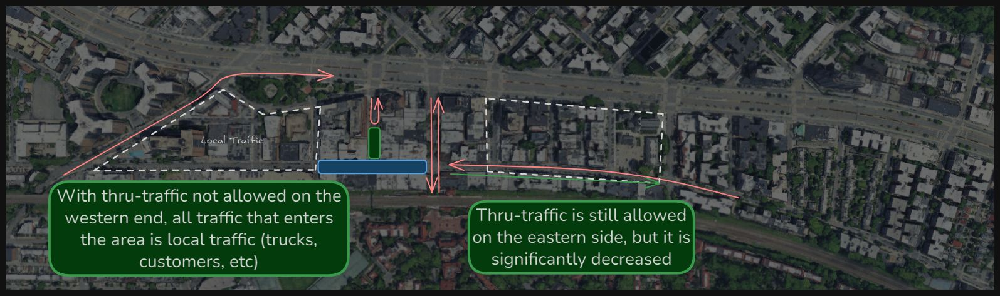

To prevent the segment east of 71st Ave from becoming a speedway, traffic calming measures need to be implemented. 31st Ave in Astoria is a good example of this treatment. 

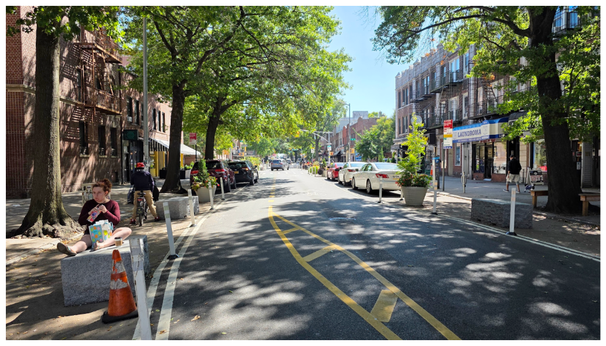

The picture above shows a chicane, blocks which can double as seating, planters, and expanded painted sidewalks. A future capital project can install rain gardens to help with flooding.

# Conclusion

This proposal fixes many issues the community currently has with the Austin Street commercial district by:

1. Optimizes north-south traffic on 71st Ave, which is a source of gridlock that can sometimes go all the way back to Queens Blvd.
2. Brings the Q23 back to Austin Street and **makes it fast!** This eliminates a lot of the headaches bus riders and other community members are suffering from while making the bus more attractive.
3. Removes the need for the pedestrian scramble at 71st Ave and Austin Street, further improving traffic flows.
4. Simplifies traffic flows on Austin St east of 71st Ave, leading to less gridlock while still allowing bike traffic to move freely, there by incentivizing bike usage which further decreases congestion.
5. Expands sidewalks all around and pedestrian spaces (70th Rd plaza).
6. Keeps all driveways accessible.
7. Allow quicker access from the 112th to 71st Ave via Austin Street for emergencies, as well as easier access to all emergencies vehicles due to the busway.

Have thoughts? Feel free to email us at info@aSaferAustinStreet.com. And don't forget to join our mailing list [here](https://forms.gle/rL9JE18rNJziUgJ47) and help us create A Better Austin Street For All!