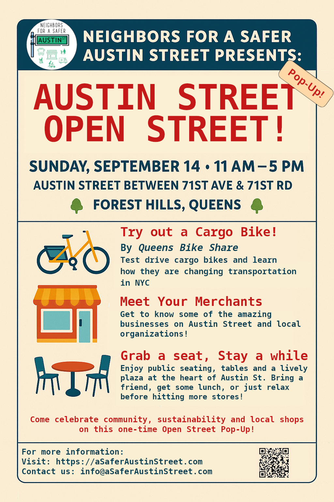

- 2022
  - A handwritten and an [online petition](https://www.change.org/ASaferAustinStreet) have been started.
  - Neighbors for A Safer Austin Street (NASAS) starts doing street canvassing and collects over 1000 signatures.
  - A business petition is also started, gathering over 20 signatures.
- 2023
  - NASAS presents to the Queens Community Board 6 Transportation Committee, and they request that DOT look into it.
  - Councilmember Lynn Schulman sends a letter to the NYC Department of Transportation (DOT) requesting a "pedestrian safety study" of Austin Street.
  - The city, via DOT, starts street canvassing. They conducted an [Austin Street survey](https://www.surveymonkey.com/r/AUSTINST?sm=GtO_2Bf11zXyuabB8CYM898ZEPgD4HDWITW1j_2FxCOyGiI_3D) among the community. They promise to do business outreach next.
- 2024
  - A year goes by, and DOT does nothing.
- 2025
  - Tired of waiting, NASAS starts an application for an Open Street on Austin Street.
  - The application is denied, with vague reasoning. But the city grants us a one-day permit for the [Austin Day Open Street trial](#austin-day-open-street-trial)
  - In the summer, the MTA removes the Q23 from Austin Street.
  - Understanding that Halloween day is the most dangerous day of the year for children, NASAS decided to use the experience from the successful Austin Day to bring, for the first time, Trick or Streets to Austin Street.

## A Safer Austin Street

The original campaign! For decades, Austin Street has been congested, with narrow sidewalks and dangerous conditions. Neighbors for A Safer Street (NASAS) was formed in 2022 to finally fix Austin Street.

Read more on the Austin Street issues and what we can do to fix them here: [A Safer, Better Austin Street](/news/a-safer-better-austin-street/).

You can sign our petition for a better, safer Austin Street here: https://www.change.org/ASaferAustinStreet

## Austin Day Open Street trial

After years of inaction from the city, NASAS applied for an Open Street permit; DOT denied it without a clear reason. But we managed to obtain a one-time permit! This trial will allow us to test the idea.

