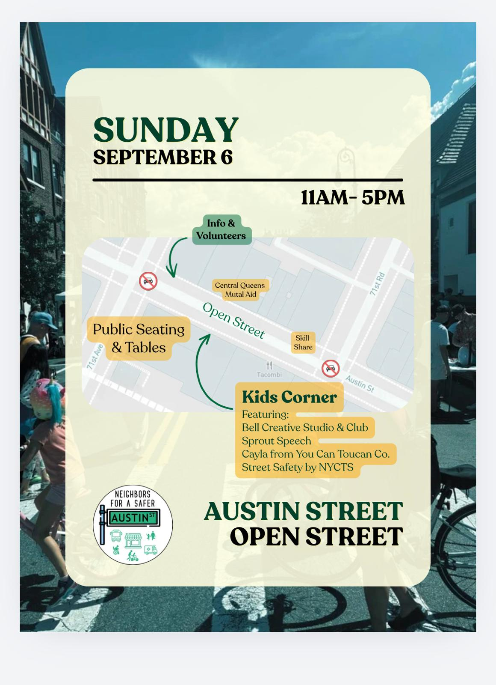

import CtaButton from '../components/CtaButton.astro';

# AUSTIN STREET OPEN STREET THIS SUMMER!

<CtaButton href="https://forms.gle/jbPLwXspdEsCM5eA9">
  Have an idea for an event? Let us know!
</CtaButton>

<CtaButton href="https://forms.gle/SQ9dbmQiZ5Moi6P19">
  Sign up to volunteer on the Open Street!
</CtaButton>

Want to stay up to date on our efforts?

<CtaButton href="https://forms.gle/EdSW5TnG5BU2Ftxc6">
  Sign up for our mailing list!
</CtaButton>

*Neighbors for A Safer Austin Street is a volunteer-led, local advocacy organization advocating for a safer, better, more sustainable, vibrant, and pedestrian-friendly Austin Street in Forest Hills*
